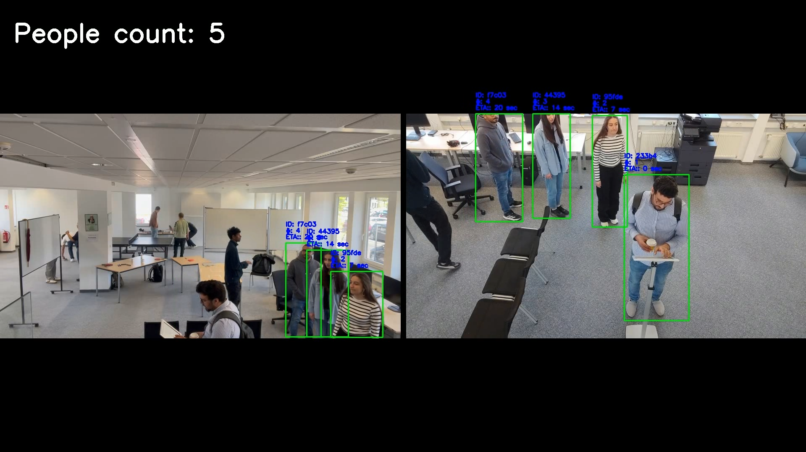

# Exercise 2: Camera-Based Queue Analysis with Person Re-Identification

This project implements a real-time queue analysis system using a dual-view camera setup. The system detects individuals, tracks them across camera angles using appearance-based embeddings, and optionally estimates their waiting time in the queue. It was developed as part of the Applied Computer Vision portfolio assignment.

## 🎯 Objective

To dynamically count the number of people waiting in an amusement park queue using a multi-camera system, avoiding duplicate counts and optionally showing the estimated waiting time for each person.

## 📦 Requirements

Install the necessary packages using:

```bash
pip install -r requirements.txt
```

Additionally, make sure to install [TorchReID](https://github.com/KaiyangZhou/deep-person-reid) and download the pretrained ReID model [resnet50](https://drive.google.com/file/d/1yiBteqgIZoOeywE8AhGmEQl7FTVwrQmf/view) before running the code.

## 🎥 Input Data

The system takes as input a **stitched dual-view video** which combines:

- **Right camera view**
- **Left camera view**

The queue starts from the left side and progresses toward the right, forming a U-shaped path across the two camera views.

## 📐 Queue Detection Logic

The queue is defined based on each person's location over the x axis.

## ⚙️ Implementation Overview

### 1. Frame Extraction

The video is processed at ~6 frames per second using OpenCV.

### 2. Person Detection

We use the `YOLOv3` model (`yolov3u.pt`) to detect people in each frame through the `PersonDetector` class in the `model.detection` module. Detections are filtered by confidence and used to generate bounding boxes.

### 3. Feature Extraction and Re-Identification

- Appearance-based features are extracted using a **pretrained ResNet50 model** from TorchReID through the `PersonReID` class in the `model.reid` module.
- For each person, an embedding vector is computed.
- These vectors are matched against a gallery of historical embeddings using cosine similarity to assign consistent person IDs.

### 4. Cross-Camera Matching

If a person appears in both right and left views, their embedding vectors are compared **within the same frame** to assign a unified ID.

### 5. Queue Entry and Exit Tracking

- When a person enters the queue zone (as defined), their entry time is recorded.
- When they exit the frame, the system calculates their time spent in the queue.

### 6. ETA (Estimated Time of Arrival)

- Each person's ETA is computed based on:

  ```
  ETA = people_in_front × average_time_per_person
  ```

- The ETA is displayed inside each bounding box.
- Our approach can update average waiting time with each person who exits the queue, improving accuracy over time.

## 📊 Output

- Real-time bounding boxes for all detected individuals
- Cross-camera consistent person IDs
- ETA values rendered on screen
- Dynamic people count inside the queue zone

## ▶️ How to Run

1. Place the video (`first-video.mp4`) in the project directory (`exercise_2_queue_analysis`).

2. Run the main script:

   ```bash
   python main.py
   ```

   Or use the Jupyter notebook:

   ```bash
   jupyter notebook main.ipynb
   ```

## ⚙️ Parameters You Can Tune

| Parameter              | Description                                                           |
| ---------------------- | --------------------------------------------------------------------- |
| `similarity_threshold` | Cosine similarity threshold for matching embeddings (default: 0.66)   |
| `confidence > 0.75`    | Minimum YOLO detection confidence to assign a new ID                  |
| `queue_boundary_y`     | Y-coordinate threshold for queue area (default: 650)                  |
| `exit_boundary_x`      | X-coordinate threshold for exit detection (default: 1910)             |
| `embedding_history`    | Controls how many previous features are stored per ID (default: 1000) |

## 📉 Limitations

- Cross-camera matching may fail if people are heavily occluded or partially visible.
- ETA assumes a continuous and stable queue without large gaps or batching.
- System relies on visual appearance and may fail with visually similar individuals.

## 🎬 Demo: Queue Analysis Output

The project includes a demo video that shows the final output of our queue analysis system.

### 🔹 What’s Shown in the Demo

- Real-time detection of individuals across two camera views
- Bounding boxes with consistent person IDs
- Estimated Time of Arrival (ETA) shown above each bounding box
- Live queue count tracking



### ▶️ Watch the Output

You can view the demo output here:

📺[Click to watch demo video](https://drive.google.com/file/d/178TXhMfKqrzMf6-Fepgv21G8GMcHcPX0/view)

> The video showcases detections across both camera views, ID consistency, and ETA estimation.
